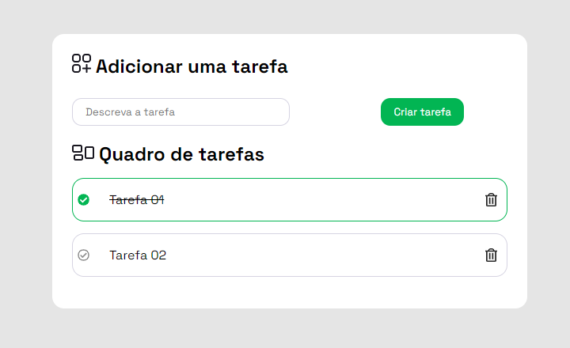

# ToDo List

The goal was to build this to-do list.

Check out the project by clicking [here](https://joseph-todo-list.vercel.app/).

## Screenshot

## Tech used

- HTML
- CSS
- JavaScript

## Author

<a href="https://www.github.com/josephmatheus">
    
    
Joseph Matheus

</a>

 

